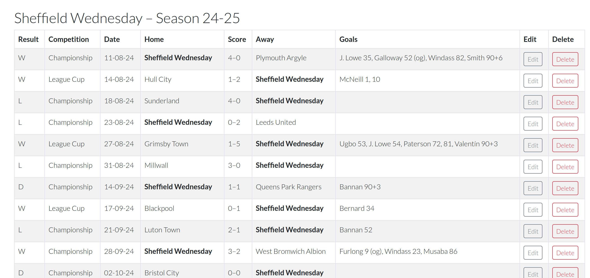

# ⚽ SeasonWatch

A football season tracking app for fans who love data.

SeasonWatch allows users to record and explore season-by-season data for their favourite football team. It is designed for individual contributors to build their own record of matches, goals, players, and lineups, with the possibility of making that data publicly viewable. The project was developed using the Django web framework and is deployed to Heroku with a PostgreSQL backend.

---

## 📖 Table of Contents

- [⚽ SeasonWatch](#-seasonwatch)
  - [📖 Table of Contents](#-table-of-contents)
  - [🧭 UX Strategy](#-ux-strategy)
    - [📂 Sample Data](#-sample-data)
  - [👥 User Stories](#-user-stories)
    - [Contributor Features](#contributor-features)
    - [Admin Features](#admin-features)
  - [Screenshots](#screenshots)
  - [🗃️ Data Models](#️-data-models)
    - [Team](#team)
    - [Season](#season)
    - [Match](#match)
    - [Entity Relationship Summary](#entity-relationship-summary)
  - [🧪 Manual Testing](#-manual-testing)
    - [Authentication and Navigation](#authentication-and-navigation)
    - [CRUD Functionality](#crud-functionality)
    - [TSV Import Functionality](#tsv-import-functionality)
    - [UI Behavior](#ui-behavior)
    - [HTML \& Code Validation](#html--code-validation)
    - [Admin Dashboard Testing](#admin-dashboard-testing)
  - [Automated Testing](#automated-testing)
    - [Components Covered by Tests](#components-covered-by-tests)
  - [📈 Agile Process](#-agile-process)
  - [🛠️ Technologies Used](#️-technologies-used)
  - [🚀 Deployment](#-deployment)
  - [📝 Credits](#-credits)

---

## 🧭 UX Strategy

This app is designed for football fans who want a personal and editable season log. Many fans keep informal spreadsheets of club stats; SeasonWatch offers a structured, scalable alternative.

> "It’s not just about the data, but about the process of recording it."

- Fans can track their favourite team's matches
- Contributors can create and manage season data
- Data can be optionally made public

The UX prioritises:

- Clean, readable layout
- Familiar, form-based data entry
- Logical URL patterns and routes per user/team/season

> After creating an account, you can upload sample match data using the TSV import feature and the provided file in the (data/) folder.

### 📂 Sample Data

A sample TSV file is included in the data/ directory of the project repository. After registering an account and logging in, you can upload this file via the Import Matches interface to populate the system with sample season data. This is a quick way to explore the application's functionality without manually entering matches.

---

## 👥 User Stories

This project was developed using Agile principles. [Full user stories are documented](https://github.com/users/wymmij/projects/3/views/1) . Below is a summary of MVP features:

### Contributor Features

- Register and authenticate securely
- Create, edit, and delete:
  - Seasons
  - Matches
  - Individual match details
- TSV import for bulk match entry
- Filter dashboard to show only own data
- View season and match details (read-only access for own content)

### Admin Features

- Access all contributor data through the Django admin dashboard
- View, search, and filter all user-submitted content
- Identify which user created each entry
- Admin-only access secured via Django’s permissions system

Post-MVP plans include lineup tracking, substitutions, enhanced match analytics, and CSV export/import functionality.

---

## Screenshots




## 🗃️ Data Models

The application's data model consists of three core entities: `Team`, `Season`, and `Match`, all linked to a `User` from Django's built-in authentication system. These models form a relational structure supporting the full tracking of team performance across seasons and matches. A simplified ERD is shown below.


### Team

Represents a football team contributed by a registered user.

- **Fields**:
  - `name`: Full name of the team (unique)
  - `short_name`: Optional abbreviation for display
  - `city`, `country`: Location data
  - `slug`: URL-safe identifier
  - `contributor`: Foreign key to `User`
  - `is_public`: Visibility toggle
- **Relationships**:
  - One `User` can create multiple `Teams`
  - A `Team` can have many `Seasons`

### Season

Encapsulates a single season for a given team.

- **Fields**:
  - `start_date`, `end_date`: Temporal range
  - `competition_list`: Comma-separated list of entered competitions
  - `slug`: Year-based slug (e.g., `23-24`)
  - `contributor`: Redundant foreign key for filtering and permission control
- **Relationships**:
  - A `Team` has many `Seasons`
  - A `Season` has many `Matches`

### Match

Represents an individual football match within a given season.

- **Fields**:
  - `date`, `time`: Scheduling information
  - `opponent`, `competition`, `round`: Metadata
  - `is_home`: Home or away flag
  - `attendance`: Optional integer
  - `team_score`, `opponent_score`: Optional integers
  - `goals`: Free-text goal description
- **Derived Data**:
  - Outcome (`W`, `D`, `L`) inferred from scores
  - Dynamic rendering of team names and scorelines

---

### Entity Relationship Summary

```plaintext
User
 └───┬───> Team
     └───┬───> Season
         └───> Match
```

- Each **User** owns one or more **Teams**
- Each **Team** can have multiple **Seasons**
- Each **Season** can include many **Matches**

---

## 🧪 Manual Testing

Throughout the development of the project, extensive manual testing was performed to ensure that core functionality behaved as expected. Testing was done iteratively, with each new feature verified both through the web interface and directly via the PostgreSQL database using command-line queries. This approach confirmed that data was being handled correctly at every stage.

### Authentication and Navigation

- ✅ Verified user registration, login, and logout workflows.
- ✅ Confirmed redirection behavior (e.g., post-login redirect to dashboard).
- ✅ Checked access control: contributors cannot access or modify data belonging to others.

### CRUD Functionality

- ✅ Created, updated, and deleted Seasons and Matches via the UI.
- ✅ Verified results directly in the database to ensure entries were correctly added or removed.
- ✅ Ensured form submissions with invalid or incomplete data did not create database entries.
- ✅ Checked that deleting a Season cascaded to remove associated Matches as expected.

### TSV Import Functionality

- ✅ Uploaded TSV files to create matches in bulk.
- ✅ Tested import with fully correct data — confirmed all rows were added.
- ✅ Tested import with partially malformed data — confirmed valid rows were added and invalid ones were ignored.
- ⚠️ **Known limitation**: The current import process does not display an error message when malformed rows are skipped. Enhancements are planned post-MVP to provide user feedback on parsing errors.

### UI Behavior

- ✅ Confirmed all views load as expected across multiple test scenarios.
- ✅ Used browser-based testing to ensure forms retain input values on error and redirect appropriately on success.
- ✅ Performed visual checks to confirm layout consistency and responsiveness (limited to desktop view).

### HTML & Code Validation

- ✅ Ran W3C HTML validator across key templates. All pages passed with only minor, non-critical warnings (e.g., self-closing tags).
- ✅ Python code was linted using a PEP8 checker. All reported issues were related to long strings in docstrings or template output — no functional issues were found.

### Admin Dashboard Testing

- ✅ Used the Django admin interface extensively during early development to inspect, add, and delete model instances before front-end forms were fully implemented.
- ✅ Verified that all major models (Team, Season, Match, Player, Goal) were properly registered in `admin.py`.
- ✅ Confirmed that each model includes contributor information, enabling attribution and filtering by user.
- ✅ Tested that list display fields, search functionality, and filters were correctly configured for each model.
- ✅ Verified that only superusers (admin accounts) could access the admin interface.
- ✅ Confirmed successful deletion of items via the admin dashboard and verified database changes via command-line PostgreSQL queries.
- ✅ Ensured relational integrity: for example, deleting a season or team did not leave behind orphaned matches or goals.

> Manual testing was conducted continuously throughout the project, not as a discrete phase but as an integral part of the development cycle. This helped ensure stability, catch edge cases early, and confirm that each new feature behaved exactly as expected in realistic usage scenarios.

---

## Automated Testing

The project followed a test-driven development (TDD) approach wherever feasible. While this required deliberate effort and discipline, the payoff became particularly evident during those phases of development where the precise feature requirements were still being clarified. Writing tests first helped define expectations more clearly and reduced the risk of building unnecessary or brittle logic.

That said, adhering to TDD was more challenging when the feature seemed obvious from the outset — a common pitfall for novice developers is to prematurely assume the correct structure, only to find later that tests would have uncovered weaknesses earlier. Nonetheless, the project settled into a productive rhythm of building out features and their corresponding tests in tandem. This workflow made it easier to catch regressions early, as newly introduced features could be immediately tested against previously working functionality.

Efforts were also made to ensure that testing was closely aligned with the defined User Stories. Many stories explicitly required testing as part of their **Acceptance Criteria**, and the development process was shaped accordingly to ensure each user-facing feature was properly validated through tests.

The `coverage` Python package was used throughout development to ensure a high level of test completeness. Effort was made to maintain **100% test coverage** for all code within the MVP scope.

### Components Covered by Tests

- User registration and authentication
- Contributor access control and permissions
- Creation and update of:
  - Seasons
  - Matches
  - Players
  - Goals
- Match detail views and season overviews
- TSV import logic (including edge cases)
- Visibility filtering by contributor
- Access restrictions for non-owners
- Admin dashboard model registration

To run the full suite of tests and display a coverage report:

```bash
coverage run --source='.' manage.py test
coverage report
```

Alternatively, to generate a browsable HTML report:

```bash
coverage html
```

---

## 📈 Agile Process

The project followed Agile methodology:

- GitHub Project board used to manage tasks
- User stories defined and tracked via issues
- MoSCoW priorities assigned (Must, Should, Could, Won't)
- One milestone used for the MVP Sprint
- Daily check-ins used to reassess scope and update tasks
- README updated incrementally alongside code

---

## 🛠️ Technologies Used

- Python 3.13
- Django 4.2.20
- PostgreSQL (Neon DB hosted via Code Institute)
- Heroku for deployment
- Bootstrap 5 + crispy-bootstrap5 for UI
- Cloudinary (planned, not implemented in MVP)
- Git & GitHub for version control and project planning

---

## 🚀 Deployment

Deployed to Heroku with settings managed via `env.py` and Heroku Config Vars.

- Static files served via WhiteNoise
- Local development uses SQLite; production uses PostgreSQL

---

## 📝 Credits

- [Code Institute](https://codeinstitute.net/) walkthroughs and Django module
- Project scaffolding inspired by Code Institute's blog project
- [Bootstrap documentation](https://getbootstrap.com/docs/4.6/getting-started/introduction/)
- Icons by [Font Awesome](https://fontawesome.com/)
- ChatGPT for generation of the ERD
- Sheffield Wednesday FC for historical data, WAWAW!
